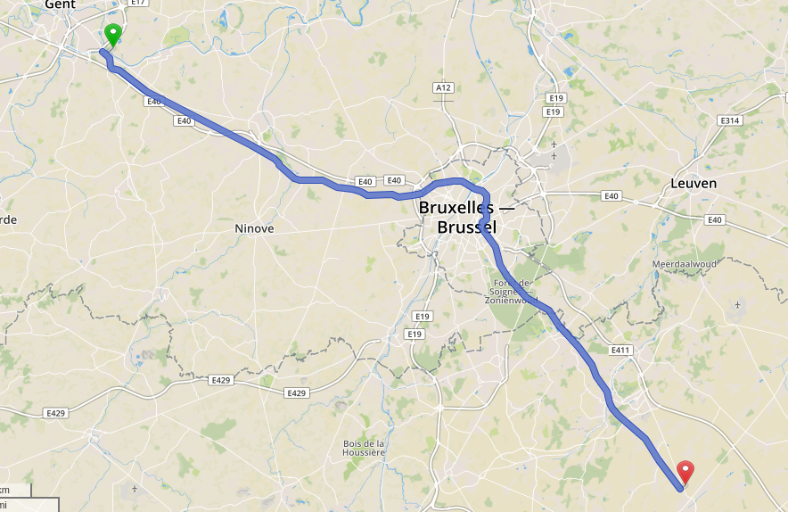

# Make OSRM profiles for trains great again

This repo contains some profiles for routing trains with [OSRM](http://project-osrm.org/).

Right now, it contains, 2 profiles :

* `basic-train.lua` : a basic/naive profile that works quite well.
* `train.lua` : a yet to be more powerfull profile. It might one day include :
    * Configuration (freight/passenger, highspeed or not, electric/diesel, gauge, ...)
    * Preferred left-hand driving even where osm does not specify it (if you know how to implement it, please be in touch !)
    * Better trun restrictions/penalties
    * Speed limitation in curves ?
    * Weight base routing instead of distance/time
    * Time penalty for trafic lights or when passing trough stations

A demo can be found [here](http://osrm-demo.partou.se/) (not uptime guaranteed at all, contains routes in Belgium only at the moment)

Inspiration for the code taken from [an old russian blog](http://flexnst.ru/2015/11/20/osrm-railway-profile/) and [the car profile](https://github.com/Project-OSRM/osrm-backend/blob/master/profiles/car.lua)
